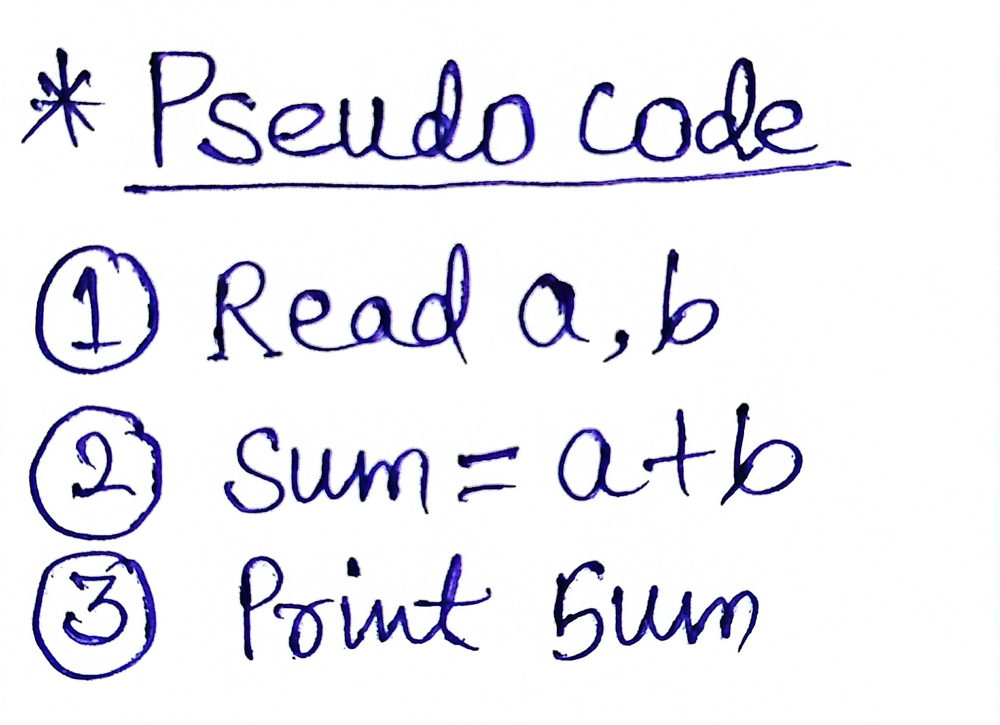
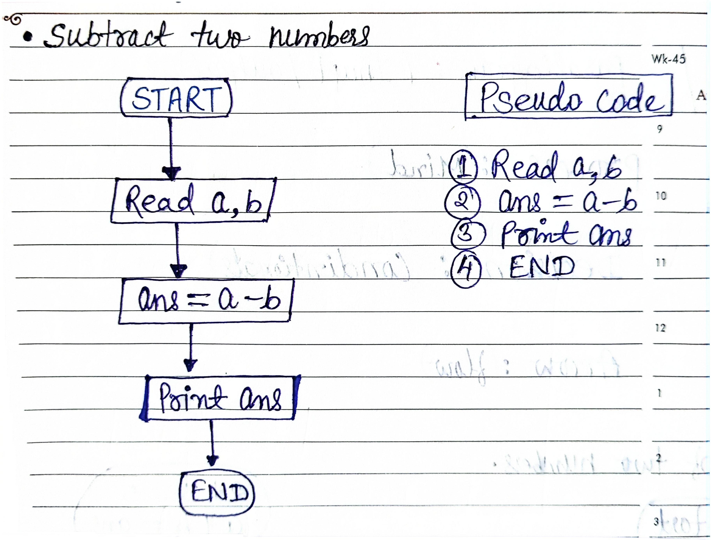
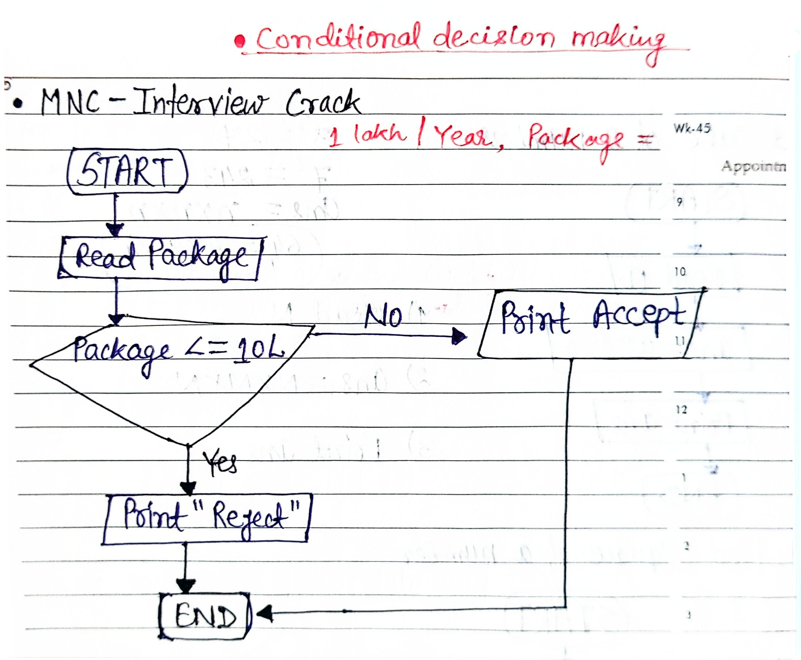
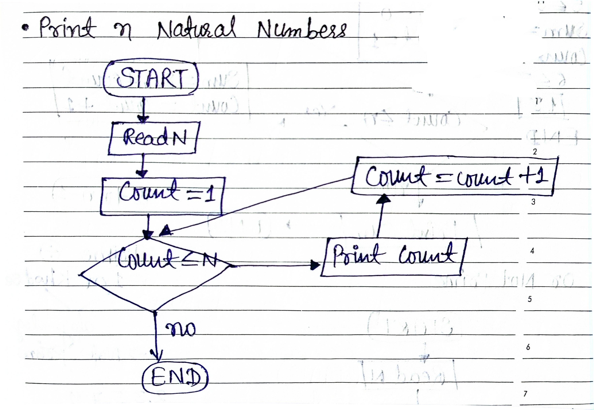

# Day 02 – Flowchart & Pseudocode

## ✅ Topics Covered:

### 1. How to Solve a Real-Life Problem (Step-by-Step Approach)

To convert a real-world situation into a program, follow this structured thinking:

1. Understand the Problem  
2. Identify Given Values  
3. Define the Approach  
4. Write the Code  
5. Test, Debug, Fix Errors  
6. Explore Other Solutions

---

### 2. What is Pseudocode?

- Pseudocode is a way to describe an algorithm using plain language (not actual code).  
- It helps to focus on logic, not syntax.
  
Example:  
Sum of two numbers:

---

### 3. Flowcharts – Visual Representation of Algorithms

Flowcharts are diagrams that represent steps using shapes:

| Symbol        | Meaning              |
|---------------|----------------------|
| Terminal  | Start / End          |
| Parallelogram | Input / Output     |
| Rectangle | Process (Logic / Calculation) |
| Diamond   | Decision (if/else)   |
| Arrow     | Flow Direction       |

Example:  
Create a flowchart to Subtract two numbers.

---

### 4. Conditional Decision Making

- Conditional logic helps in decision making in programs.
- Common in interviews and real-world logic building.

Example: MNC- Interview Crack

---

### 5. Loops in Programming

- Problem Statement: Make 10 cups of tea
- Reality: 1 cup at a time → Repeat process 10 times  
- This is what we call a loop.

Example: Print first n natural numbers

---

🧠 Summary:

- Learned how to break down a real-life problem into steps

- Understood pseudocode basics and flowchart shapes

- Explored conditionals and loops with relatable examples

This foundation will help in developing logic for future problems.

> Thank you Rohit Bhaiya 🙏

---