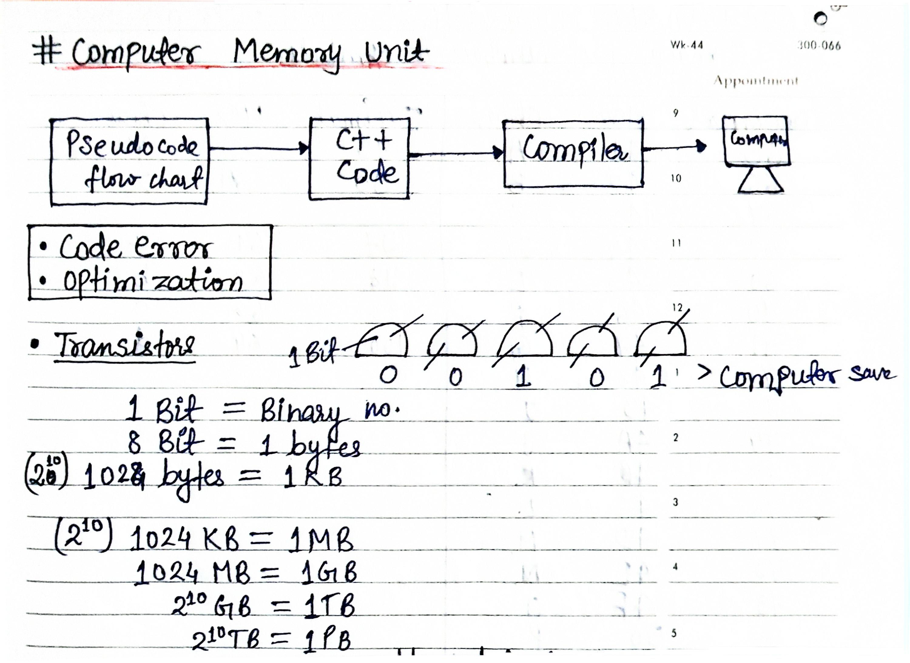
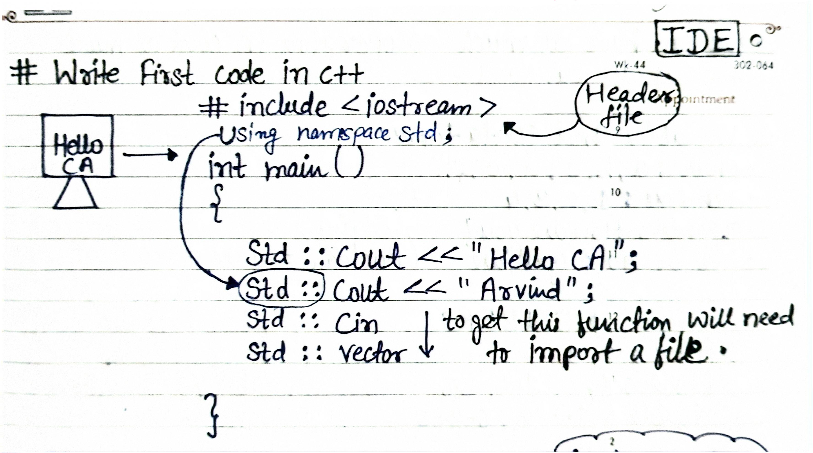
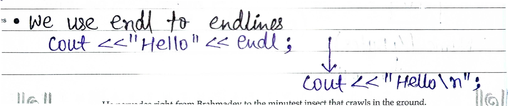
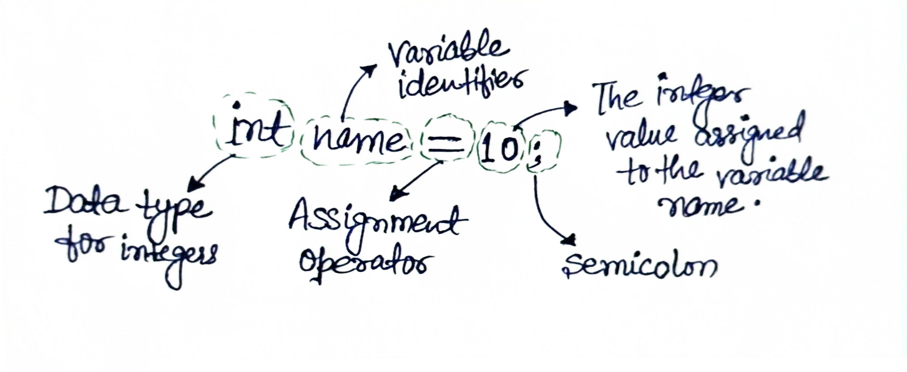

# Day 03 – Start C++ First Code

## ✅ Topics Covered:

1. **Computer Memory Unit**  
   - Basic building blocks where data is stored in a computer.

2. **Transistors**
   - Tiny switches that control the flow of electricity and store bits.

3. **How Data is Stored in Memory**  
   - Data is stored as binary (0s and 1s) in memory cells.

4. **ASCII Table**  
   - A character encoding standard that assigns numeric codes to letters and symbols.

5. **Write First Code in C++** 
   - Writing and running your first C++ program.

6. **Using endl to End Lines**  
   - endl inserts a newline and flushes the output buffer.

7. **Variables & Data Types**
   - Containers to store data with specific types like char , numbers (int), words (String)..  
     - (i) Numbers (Int , Float , Double) 
     - (ii) Words (strings)  
     - (iii) Gesture (Boolean: True/False)  
     - (iv) Char

     Characters are single character, not more than one.

### Example:

---

## 📋 Summary

- Learned about computer memory units and how data is stored.  
- Understood the role of transistors as tiny switches.  
- Explored binary storage and the ASCII table for character encoding.  
- Wrote the first C++ program and used endl for new lines.  
- Introduced to variables and data types to store different values.  
- Practiced declaring integer variables and assigning values.
---